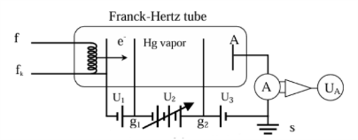
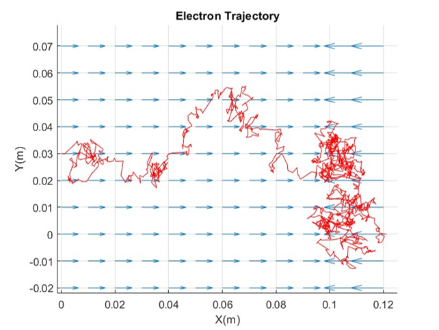
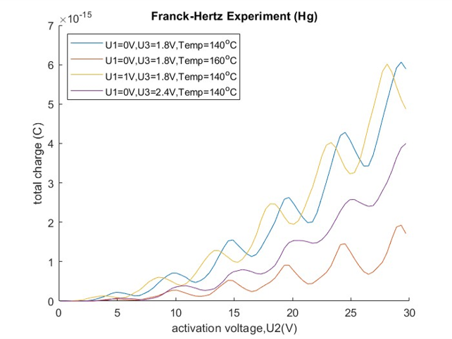
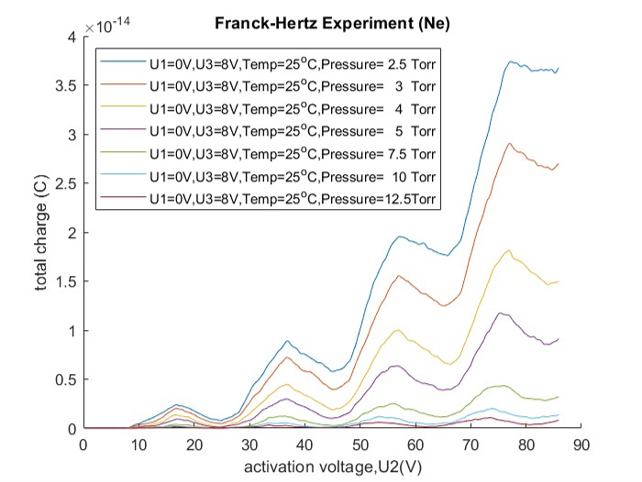
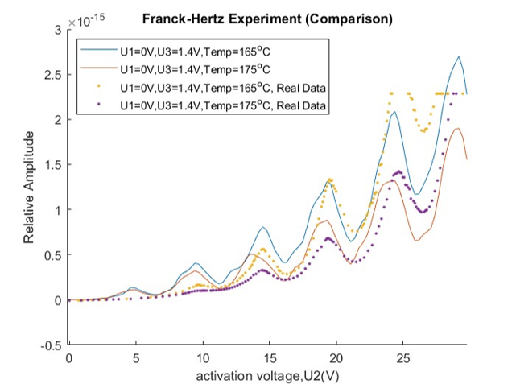

# The-Franck-Hertz-Experiment-Simulation
Abstract
---

The Franck-Hertz experiment demonstrates that atoms possess discrete energy states rather than a continuous spectrum. However, there is a lack of detailed explanations in existing literature regarding the actual dynamics of electrons. In this project, we aim to simulate the detailed motion of electrons and discuss the influence of different environmental setups.

---
Usage
---

To run the program, execute `exp_script.m`. The script `flow.m` will add the `\include\` and `\src\` directories to the path.

The program outputs raw data to the `\data\` directory, with the filename being the current timestamp (in CSV format). `flow.m` also outputs the absolute path of the corresponding file. You can choose to construct a list of output variables or absolute paths and input them into `plotter.m` for plotting (Please note that the data will pass through a low-pass filter in `plotter.m` to obtain a more ideal curve).

`flow.m` has several variables, with different parameter settings for Hg and Ne:

- `U1`: Initial voltage
- `U2max`: Maximum acceleration voltage
- `U3`: Cut-off voltage
- `para`: For mercury, this is the temperature parameter (Celsius); for neon, this is the pressure value (Torr)
- `Atom`: Currently accepts "Ne" or "Hg". If unrecognized, the default is "Hg" (case insensitive)
- `Interval`: Curve value interval (simulation time increases as interval decreases)
- `Precision`: Experimental precision (simulation time increases as precision increases)

**Currently, the program's efficiency is low. It is not recommended to run the script with an acceleration voltage higher than 80V or with a low interval.**

`exp_script.m` also has corresponding execution methods, and you can choose to uncomment and use them directly.

Please do not change the internal folder structure, as it may cause some programs to fail to find the corresponding `.m` files or output locations.

---
Child-Langmuir Law
---

The Current amplitude inside the vacuum tube can be derived from Child-Langmuir Law.  The equation can be expressed as:
$$I(U_2) = \frac{4}{9} \frac{\epsilon_0}{d^2} \sqrt{\frac{-2q_e}{m_e}} U_2^{3/2} \, \text{mA} \propto U_2^{3/2}$$

---
Free Mean Path
---
The probability density function of the distance between each collision is:
$$f_L(l) = \lambda \exp(-\lambda l)$$
The approximation of vapor pressure of Mercury between 300k to 500k and the formula of free mean path can be described as:
$$\lambda = \frac{k_B T}{\sqrt{2} \sigma P}, \quad P \approx 8.7 \cdot 10^{(9 - \frac{3110}{T})} \, \text{Pa}$$

---
Selection Rule
---
The states of an atom can be expressed using Term symbol, which has the form 
$` ^{2S+1}L_J `$. Transition can occur if it satisfies the selection rule:
$$
\begin{cases}
    \Delta L = 0 \text{ or } \pm 1 \\
    \Delta J = 0 \text{ or } \pm 1 \quad (0 \nrightarrow 0)
\end{cases}
$$

---
Result
---

